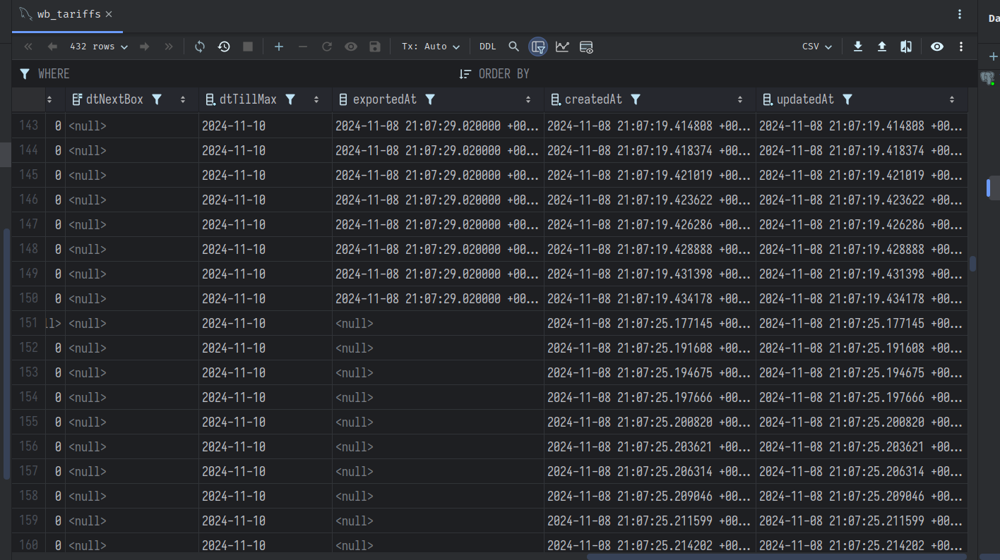
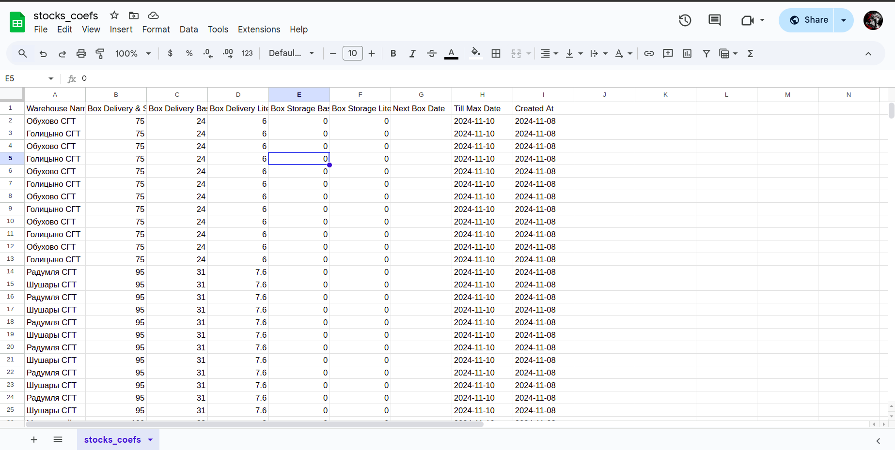

Весь код разделен на несколько сервисов:
- **[WbApiService](src/modules/wb/wb-api.service.ts)** — для получения данных с API Wildberries.
- **[WbApiParserService](src/modules/wb/wb-api-parser.service.ts)** — формирует данные по ожидаемому типу.
- **[WbTask](src/modules/wb/wb.task.ts)** — реализует задачи используя крон.
- **[WbService](src/modules/wb/wb.service.ts)** — обеспечивает услуги для взаимодействия с ORM.
- **[SheetsService](src/modules/sheets/sheets.service.ts)** — для выгрузки данных в Google Sheets.
- **[KnexService](src/database/knex.service.ts)** — для работы с базой данных PostgreSQL.
- **[Миграции](src/database/migrations)** для создания таблицы `wb_tariffs` в базе данных.

Также настроен [Dockerfile](Dockerfile) для контейнеризации приложения и взаимодействия с базой данных PostgreSQL через [docker-compose.development.yml](docker-compose.development.yml).

### Подробности:
- **[WbApiService](src/modules/wb/wb-api.service.ts)** использует Axios для отправки запросов к API Wildberries.
- **[WbTask](src/modules/wb/wb.task.ts)** выполняет задачи каждый час для получения тарифа боксов и записывает в гугл таблицы боксы которые не были экспортированы.
- **[KnexService](src/database/knex.service.ts)** работает с PostgreSQL через Knex.js для сохранения тарифов в таблице.
- **[SheetsService](src/modules/sheets/sheets.service.ts)** взаимодействует с Google Sheets API для выгрузки данных в таблицы.

Чтобы продолжить, выполните следующие шаги:
1. Создайте .env файл:
```bash
    touch .env
```
2. Скопируйте [.env.development](.env.development) в .env:
```bash
  cp .env.development .env
```
3. Запустите сборку: 
```bash
  docker compose -f docker-compose.development.yml up -d
```
5. Запустите миграцию:
```bash
  npx knex migrate:latest 
```
5. Для удобства настройка крон в удобный формат времени в [wb.task.ts](src/modules/wb/wb.task.ts)
6. Завершите процесс
```bash
docker compose -f docker-compose.development.yml down -v
```


